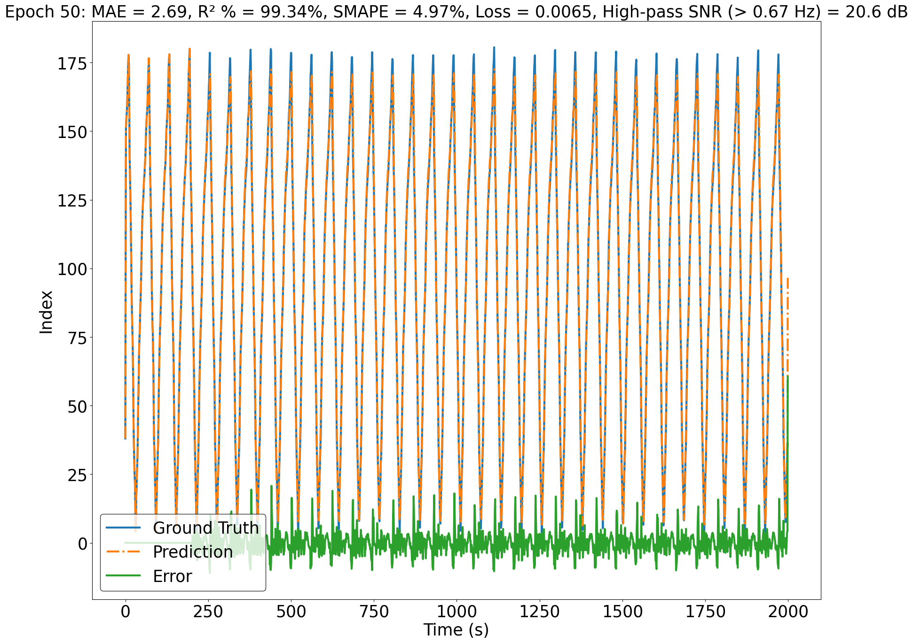
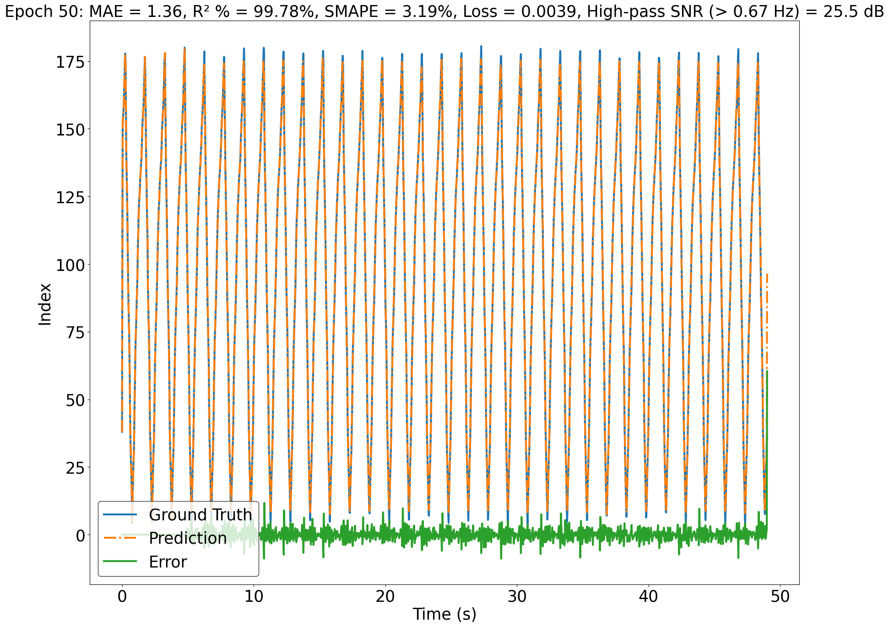
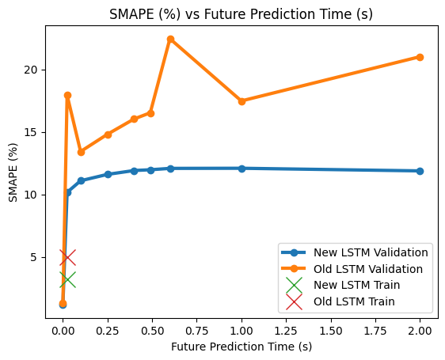

# TIme Series Forcasting for On-the-Fly 3D Printer Control

## Description
The goal of this project is to improve the LSTM algorithm used by a six-axis 3D printer to predict the state of the surface 
to be printed on. To begin this process, a high resolution, low frequency depth camera is used to capture high quality 
point clouds of the surface at various stages in its relatively periodic motion. The point clouds are processed into high 
quality meshes, soft correspondence is preformed on them to link points that represent physical locations on the surface 
between the different mesh states, and the scans are interpolated between to increase the spatial resolution of the possible 
mesh states. A pattern to be printed is then designed on the mesh state with the least deformation and this pattern is projected 
onto all the mesh states. Immediately prior to printing, a low resolution, high frequency depth camera is used to monitor the current state
of the surface. The camera captures a point cloud of the mesh state, preforms some postprocessing, and finds the id of the high quality
mesh that best represents the current surface state (has the lowest chamfer loss). The printer observes the shape change of the surface 
for a period of time, creating a history of mesh states (ids) the surface goes through during that period. That data is used to train a
model with one LSTM layer and two linear layers (the first of which has an activation function on its output) to predict a mesh state at a 
time in the future given an input window of the history of mesh states up to that point.

## Install
```
conda create --name TSF python=3.10
conda activate TSF
pip install --index-url https://download.pytorch.org/whl/cu116  --no-deps torch==1.13.0+cu116
pip install -r requirements.txt
```

## Datasets
The main datasets used in this project, found in the [datasets](/datasets) folder, are time histories of the surface ids collected during printing trials.
There are two different collections of data, one corresponding to the surface state changing with a dominant frequency of [0.67 Hz](/datasets/0.67%20Hz%20membrane) and one with a
dominant frequency of [2 Hz](/datasets/2%20Hz%20membrane). Within the data folders and files there is additional collected data and plots representing different evaluation criteria
of the trial, but we will only be utilizing the surface state time history within the lists.pkl files. Within the surface state time histories, there
are three distinct sections of collected data corresponding to different depth camera sampling rates. The first section of data corresponds to the highest
camera sampling rate (~ 40 Hz) and is the data the model will be trained on for a printing trial. The next section is data collected while predictions are being made, 
and therefore the camera sampling rate (~ 18 Hz) has decreased due to the computational load. The final section is data collected while predictions are being made and
commands are being sent to the printer, and therefore the camera sampling rate  (~ 10 Hz) has decreased again due to the additional computational load.
In application, the algorithm will be trained on the data collected at the high sampling rate (far above Nyquist criterion) and needs to make accurate predictions
on data at a lower sampling rate (still above Nyquist criterion), which presents a challenge.

In addition to data collected at different sampling rates and from different trials (both with different and the same surface frequency), the algorithm will be
tested on data with completely different periodic form than the training data. This data will come from the pydicom example time series datasets, which includes
electrocardiogram (ECG), respiratory, and audio waveforms collected at a constant sampling frequency.

## Performance Metrics
The point of this project is to accurately predict a time series value at a point in the future given the history of its values. Therefore, we are primarily concerned with how well our predicted 
time series represents the shape of the ground truth time series, especially around high frequency features where the model has historically struggled. To evaluate the performance, four metrics
were chosen and calculated between the full predicted trace and ground truth time series. The metrics are the Mean Absolute Error ([MAE](#MAE)), percent variance explained ([R² %](#r-)), Symmetric Mean Absolute 
Percentage Error ([SMAPE](#SMAPE)), and High-Pass (frequencies greater than the first harmonic of the ground truth series) Signal-to-Noise Ratio ([SNR](#High-Pass-SNR)).

### MAE
The MAE gives shows the average absolute deviation of the predictions from the ground truth in the original units (surface state id). Therefore, it gives an idea of how far off the predict surface
state is from the actual state on average. The MAE was calculated as:

```math
\mathrm{MAE} \;=\; \frac{1}{N} \sum_{i=1}^{N} \bigl\lvert \hat{y}_{i} - y_{i} \bigr\rvert
```


where:
- $N$ is the number of samples,  
- $\hat{y}_{i}$ is the predicted value for sample $i$,  
- $y_{i}$ is the ground‑truth value for sample $i$. 

### R² %
The R² % quantifies how much of the global variability in the ground truth the model captures. A high R²% means the predictions are accurate for the global behavior of the ground truth. The R² % was 
calculated as:

```math
R^{2} \;=\; 1 \;-\; \frac{\displaystyle\sum_{i=1}^{N} \bigl(y_{i} - \hat{y}_{i}\bigr)^{2}}{\displaystyle\sum_{i=1}^{N} \bigl(y_{i} - \bar{y}\bigr)^{2}}
\quad,\quad
R^{2}\%  \;=\; 100 \times R^{2}
```

where:
- $N$ is the number of samples,  
- $\hat{y}_{i}$ is the predicted value for sample $i$,  
- $y_{i}$ is the ground‑truth value for sample $i$,  
- $\bar{y} = \frac{1}{N}\sum_{i=1}^N y_i$ is the mean of the ground‑truth values.  

### SMAPE
The SMAPE measures point‑wise, relative accuracy in a scale‑aware, symmetric way. A low SMAPE means the predictions are accurate for the local behavior of the ground truth. The SMAPE was calculated as:

```math
\mathrm{SMAPE} \;=\; \frac{100\%}{N}\sum_{i=1}^{N}
\frac{\bigl\lvert \hat{y}_{i} - y_{i}\bigr\rvert}
     {\tfrac{1}{2}\bigl(\lvert \hat{y}_{i}\rvert + \lvert y_{i}\rvert\bigr)}
```

where:
- $N$ is the number of samples,  
- $\hat{y}_{i}$ is the predicted value for sample $i$,  
- $y_{i}$ is the ground‑truth value for sample $i$.

### High-Pass SNR
The high‑pass SNR quantifies in decibels how much power the true signal’s high‑frequency component, above cutoff $f_c$ (the first harmonic of the ground truth data), has relative to the error power 
in that same band. Higher SNR values indicate stronger preservation of the high‑frequency band relative to the prediction error, for example an SNR of 20 dB means the ground truth high‑frequency power 
is 100 times greater than the error power, reflecting excellent fidelity. The high‑pass SNR was calculated as:

```math
\mathrm{SNR}_{\mathrm{hp}}(f_c)
\;=\;
10 \log_{10}
\biggl(
\frac{\tfrac{1}{N}\sum_{i=1}^N y_{\mathrm{hp},i}^2}
     {\tfrac{1}{N}\sum_{i=1}^N \bigl(y_{\mathrm{hp},i} - \hat y_{\mathrm{hp},i}\bigr)^2}
\biggr)
```

where:
- $y_{\mathrm{hp},i}$ and $\hat y_{\mathrm{hp},i}$ are the ground‑truth and predicted values after high‑pass filtering above cutoff frequency $f_c$,  
- $N$ is the number of samples.  


## Model Training Workflow 
The data for training is first resampled to a constant time step time base and is zero mean and unit variance normalized. The data is then divided into batches,
where the input is a data sample containing a number of points equal to the value of the variable seq_len (sequence length) and its label is the same collection of data plus a number of additional samples into the future. For training,
the model receives the input of original data and is autoregressively (adding an output one time step into the future onto the end of the input data)
used to make the same number of predictions into the future as the labels were established with. The loss is then calculated on all the future autoregressive outputs produced
for the input sample of original data. The loss function is a combination of mean squared error (MSE), a convolutional first derivative (to capture more 
information regarding the performance around low frequency features), and a dilated convolutional first derivative (to capture more information regarding the performance 
around high frequency features). Every certain number of epochs, the performance metrics of the model are evaluated on the training data by feeding in a rolling sequence length
input window of the data and predicting one time step into the future to effectively recreate the ground truth data. In implementation, the time into the future the model needs 
to predict the surface state at is not constant and depends on different hardware and software limitations. This is accounted for during printing by utilizing the cross correlation 
of the printer position history and printing surface state history to adjust the time into the future to predict. Therefore, the model is trained to autoregressively make predictions 
0.49 s into the future, which is larger than the prediction window typically seen during trials (0.15 - 0.35 s).

## Model Validation Workflow 
For validation, data in the same form as the training data, but from a different sample, is utilized. The data is implemented as it would be in on-the-fly printer control, giving a 
rolling sequence length input window of data to the model. The window of data is resampled to have the same time step as the resampled training data and is normalized using the 
same zero mean and unit variance as the training data. The model is used to autoregressively make predictions a constant time into the future, 0.25 s is what it is currently set to 
and was used for the plots in the two update sections (various prediction times are evaluated in the [Discussion](#discussion) section). If the time into the future to predict is not a multiple of the 
resampled time step, an extra autoregressive output is produced and the predicted point is linearly interpolated between the last two outputs.

## Run Instructions for Validation Sample
To run the trained neural network on a validation sample, open and run the [TestLSTM1.py](/TestLSTM1.py) file. It will run the predictions in the manner detailed in the last section and plot the ground truth
data, predicted data, and error as a function of time, with the performance metrics listed in the title (they will print to the terminal as well). The plots, one of the entirety of the data 
and one of the last six seconds of data, will be saved in the [\TimeSeriesForcasting\testfuncs\test_output\LSTM1](testfuncs/test_output/LSTM1) folder and can be seen in the 
[Second Model Performance Update](#Second-Model-Performance-Update).

## First Model Performance Update
The initial backbone of the model developed in this project was started by a former student in my lab and was completed and improved upon by myself. This first update represents the 
combination of our efforts and the state of the model midway through the semester. This model does not use autoregressive outputs in the training, instead only computing the loss on one
resampled time step into the future. The loss function was only MSE and it used a relu activation function after the first linear layer. Additionally, the model was found to improperly 
handle normalization and have a poor method of interpolating predicted data at predictions times into the future that were not multiples of the resampled time step. The model was trained 
on the high sampling rate data from [\TimeSeriesForcasting\datasets\0.67 Hz membrane\4-17-25\1\lists.pkl](datasets/0.67%20Hz%20membrane/4-17-25/1/lists.pkl) and validated on the high sampling 
rate data from [\TimeSeriesForcasting\datasets\0.67 Hz membrane\4-17-25\2\lists.pkl](datasets/0.67%20Hz%20membrane/4-17-25/2/lists.pkl).

Specifically, this model struggled to make predictions around high frequency features near the peaks of the ground truth data, as can be seen in this [plot](testfuncs/test_output/LSTMOG/prediction_zoom.png). 
The model would round off these features, effectively causing the predicted signal to lag behind the ground truth and not reach a large enough amplitude.

<table>
  <tr>
    <td align="center">
      <br>
      <sub>Training Data</sub>
    </td>
    <td align="center">
      <br>
      <sub>Validation Data</sub>
    </td>
  </tr>
</table>


## Second Model Performance Update
This model represents my efforts to rebuild the training, evaluation, and prediction functions to fix errors and produce better performance. It uses the exact [training](#model-training-workflow) and 
[validation](#model-validation-workflow) workflows detailed above. Additionally, it uses a tanh activation function after the first linear layer and properly handles normalization and output 
interpolation. Some additional adjustments were made to better handle memory allocation and to limit the passing of data between the cpu and gpu in order to try to minimize the computational cost 
of predictions. The model was trained on the high sampling rate data from [\TimeSeriesForcasting\datasets\0.67 Hz membrane\4-17-25\1\lists.pkl](datasets/0.67%20Hz%20membrane/4-17-25/1/lists.pkl) 
and validated on the high sampling rate data from [\TimeSeriesForcasting\datasets\0.67 Hz membrane\4-17-25\2\lists.pkl](datasets/0.67%20Hz%20membrane/4-17-25/2/lists.pkl).

<table>
  <tr>
    <td align="center">
      <br>
      <sub>Training Data</sub>
    </td>
    <td align="center">
      <br>
      <sub>Validation Data</sub>
    </td>
  </tr>
</table>

## Discussion

The current model performance saw almost perfect accuracy during training, with only slight amplitude errors in the peaks and troughs of the data. This performance degraded slightly on the 
validation data with larger error seen in the troughs of the data (with a high error around what seems like a discrepancy in the ground truth data). It is important to note
that these two collections of data (training and validation) were collected in an identical manner, at similar sampling rates, and with the printing surface moving in identical manners. The better 
performance on the training data is expected, not only because that is how neural networks perform, but also because it was tested without making autoregressive inputs (only predicting one time 
step in the future to save computational time), whereas the validation data utilized autoregressive inputs to predict 0.25 s into the future. Despite making the comparison more convoluted, the use 
of the validation data is more similar to the intended final use case and the fact that there was only a minor decrease in performance is significant given the majorly increased potential for error 
introduction with the use of autoregressive predictions.

The performance, from the first update to the second update, particularly improved around the high frequency features at the peaks of the data, as can be seen in the zoomed in 
[plot](testfuncs/test_output/LSTM1/prediction_zoom.png). It is currently unknown whether the performance achieved here is 'good enough'. The model changes need to be implemented in the printer 
control code to see if the performance produced with this model results in prints with higher quality than the previous model. If the performance needs to be improved further, a frequency based 
adaptive filtering technique can be implemented to correct the errors of the LSTM based on a history of its mistakes, specifically around sharp features like the trough. This has begun to be 
developed in the [QKLMS.py](models/qklms.py) file. Additionally, the training method can be altered to utilize input data originally sampled at a variety of rates to build in resilience to any
changes in the camera sampling.

The performance of the models was also evaluated on the validation data for other prediction times into the future besides just 0.25 s, as in the validation data previously displayed, to see 
how the models will perform if other prediction times are necessary. For the plots below, the new LSTM was trained with autoregressive outputs up to 0.49 s in the future and was tested on the 
training data with a prediction time of 0.0245 s and the old LSTM was trained with one output 0.0245 s in the future and was tested on the training data with a prediction time of 0.0245 s. It is 
currently unknown why the erroneous spikes in the performance metrics are experienced, this will be investigated further.

<table>
  <tr>
    <td></td>
    <td></td>
  </tr>
  <tr>
    <td></td>
    <td></td>
  </tr>
</table>

## Run Instructions for Test Samples
To run the trained neural network on a test sample, open and run any of the python files within the subfolders within the [\Final_Tests](Final_Tests) folder. It will run the predictions in the manner detailed in 
the [Model Validation Workflow](#model-validation-workflow) section and plot the ground truth data, predicted data, and error as a function of time, with the performance metrics listed in the title (they will print to the terminal as well). The file within the 
[\0.67Hz_Membrane_Low_Sampling](Final_Tests/0.67Hz_Membrane_Low_Sampling) folder will run the predictions on the low camera sampling rate data from the same data collection as the training data, therefore, it most 
accurately simulates the implementation of the trained model as it would be in the 3D printer control. The file within the [\2Hz_Membrane_High_Sampling](Final_Tests/2Hz_Membrane_High_Sampling) folder will run the predictions
on the high camera sampling rate data from a data collection where the membrane deforms at a dominant frequency of 2 Hz and the file within the [\2Hz_Membrane_Low_Sampling](Final_Tests/2Hz_Membrane_Low_Sampling) folder
will run the predictions on the low camera sampling rate data from a different data collection where the membrane deforms at a dominant frequency of 2 Hz. Finally, the file within the [\ECG](Final_Tests/ECG) will run
the predictions on a 10 s sample of electrocardiogram (ECG) data from the pydicom example dataset sampled at ~1 kHz.